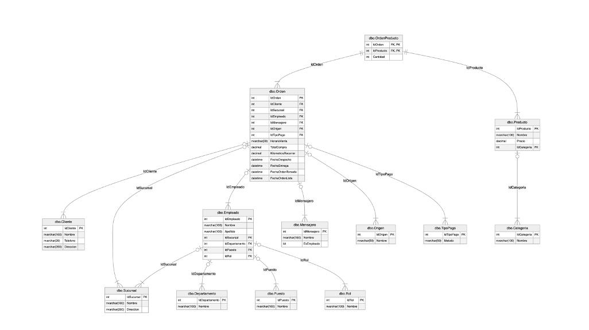

# SQL Server – Fast Food Analytics

**Stack:** SQL Server (script único: DDL + DML + consultas KPI) · SSMS / Azure Data Studio  
**Dataset:** Cadena de fast food (demo educativa)

---

## 🎯 Objetivo
Ejecutar **un solo script** que:
- cree el **esquema y relaciones**,
- cargue **datos de prueba**,
- y exponga **consultas de negocio (KPIs)**: ingresos por canal, productividad por empleado, tiempos de entrega, demanda por horario y tendencia mensual.

---

## ▶️ Cómo ejecutar

1. Abre **SSMS** o **Azure Data Studio**.
2. ```sql
   CREATE DATABASE SistemaPedidos;
   GO
   USE SistemaPedidos;
   GO

	3.	Ejecuta todo el archivo 👉 sql/fastfood.sql

⸻

📊 KPIs (qué responde)
	•	Ingresos por canal (delivery, salón, app, etc.).
	•	Productividad por empleado (ventas asociadas).
	•	Tiempos de entrega (de despacho a entrega).
	•	Demanda por franja horaria y ticket promedio.
	•	Tendencia mensual de ingresos/pedidos.

Las consultas exactas están al final del script 👉 sql/fastfood.sql.

⸻

📁 Estructura del repo
	•	sql/
	•	fastfood.sql — script único (schema + seed + queries KPI)
	•	docs/
	•	fastfood.pdf — informe/presentación
	•	img/
	•	mersql.jpeg — diagrama entidad–relación (MER)
	•	README.md
	•	LICENSE

⸻

🧩 Modelo ER

<p align="center">
  
</p>

⸻

📄 Informe

Revisa el documento 👉 docs/fastfood.pdf con el detalle del modelo y los hallazgos.

⸻

✅ Checklist rápido
	•	BD creada/seleccionada.
	•	Ejecutado sql/fastfood.sql.
	•	Validadas las consultas KPI (devuelven resultados).
	•	(Opcional) Subido img/mersql.jpeg o docs/fastfood.pdf.

⸻

Autor: Eric Sanchez — Data Analyst (Admin & Finance)
